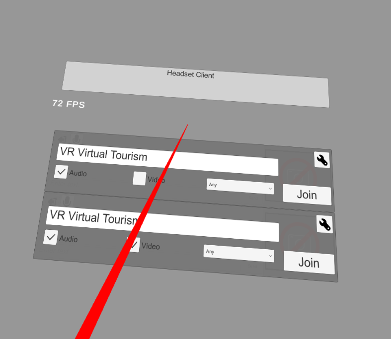
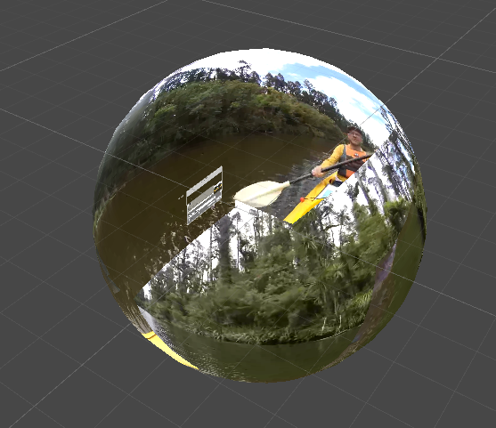
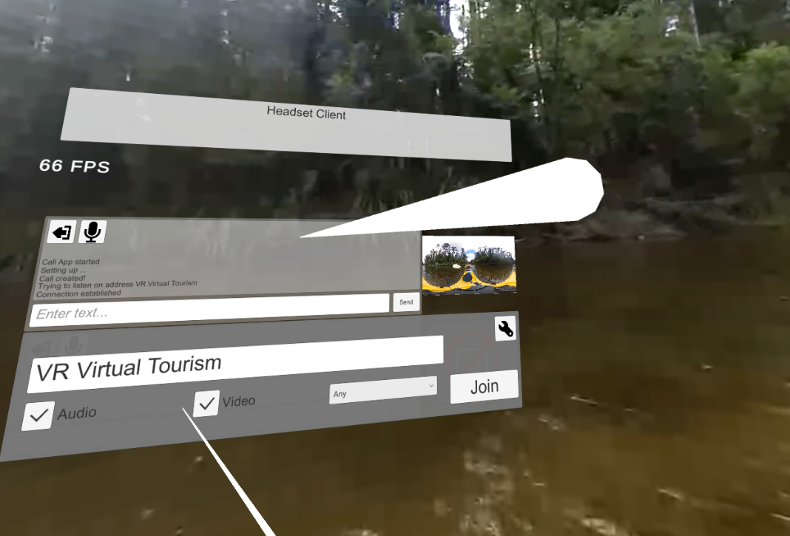
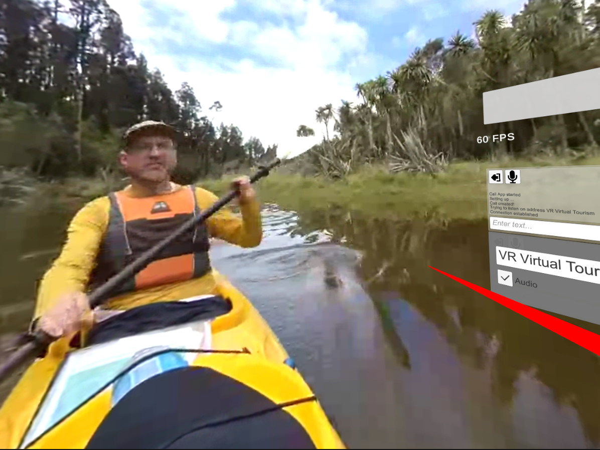
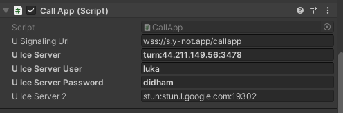

# Virtual-Tourism-Headset-Client-

### Project Purpose
To explore the applications of Virtual Reality Tourism in NZ with the use of peer-to-peer internet connetion protocals and 360 cameras. The system uses live streamed 360 video between Unity Clients using WebRTC. 

### Client Description (Headset)
The Headset Client is much the same as the Camera Client except instead of being connected to a 360 camera it is running standalone on a headset (Quest 1/2) and is only sending audio and not video and is recieving both video and audio. The types of data sent across the chanel can be toggled shown in the UI below. 

The client is recieving/sending a stream through a WebRTC connection. The video stream is then rendered onto the sphere giving the 360 affect shown below. 

The Demo video shown in the images is being sent by the camera client running seperatly on another machine. In the image below we can see two connection panels. There is two connection panels to enable connection withon an app however more often will want to only use one connection panel shown below. In the connection panel we can see a preview render of the camera client peer stream. We can also access resolution and FPS information from clicking on the preview panel.   

